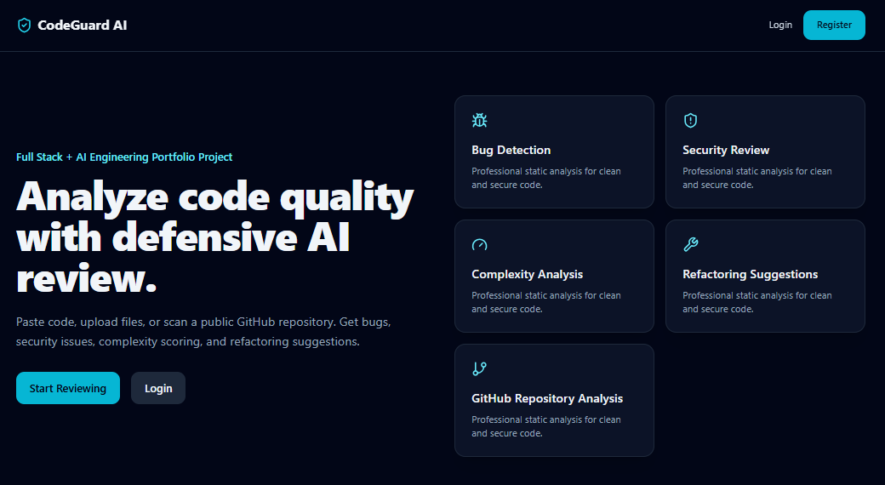

<div align="center">

# 🛡️ CodeGuard AI  
### 🤖 AI Code Review & Bug Detection Platform


<br/>


<br/>

**🚀 Production-quality full-stack AI project for Full Stack Developer and AI Engineer internship portfolios.**

</div>

---

## 📸 Project Preview

<div align="center">



</div>

---

## 🚀 Overview

**CodeGuard AI** is an AI-powered code review and bug detection platform that helps developers improve code quality through **defensive static analysis**.

Users can:

✅ Paste code directly into the editor  
✅ Upload source code files  
✅ Analyze a public GitHub repository  
✅ Detect bugs, security issues, and code smells  
✅ View quality, maintainability, and complexity scores  
✅ Receive safe refactoring and best-practice suggestions  

Supported languages:

| Language | Support |
|---|---|
| 🟨 JavaScript / TypeScript | Static rule-based analysis |
| 🐍 Python | AST parsing + Radon complexity |
| ☕ Java | Static rule-based analysis |

---

## 🎯 Project Purpose

This project was designed as a **next-level individual portfolio project** for internship roles.

| Target Role | What This Project Shows |
|---|---|
| 💻 Full Stack Developer Intern | React, Node.js, REST APIs, JWT auth, MongoDB, dashboards, file uploads |
| 🤖 AI Engineer Intern | FastAPI AI microservice, static analysis, scoring logic, language analyzers |
| 🛡️ Secure Coding / Code Quality | Defensive security review, validation, maintainability feedback |

---

## 🛡️ Safety Scope

> CodeGuard AI is built only for **defensive secure coding education** and **software quality improvement**.

This platform does **not** generate:

- ❌ Exploit payloads
- ❌ Malware logic
- ❌ Credential theft instructions
- ❌ Vulnerability abuse steps
- ❌ Harmful hacking guidance

Security findings are explained in a safe, defensive way with recommended fixes.

---

## 👨‍💻 Developer Features

- 🔐 Register and login with JWT authentication
- 👥 Developer and admin roles
- 🧠 Paste-code analyzer with Monaco Editor
- 📁 File upload analyzer
- 🌐 Public GitHub repository analyzer
- 🐞 Bug detection
- 🛡️ Defensive security issue detection
- 🧹 Code smell detection
- 📊 Quality score
- 🧩 Maintainability score
- ⚙️ Complexity score
- 🔧 Refactoring suggestions
- ✅ Best-practice recommendations
- 🕘 Review history
- 🔍 Search and filter reviews
- 📄 Detailed review page
- ⬇️ JSON report download

## 📊 Admin Features

- 📌 Total reviews count
- 👥 Users count
- 📈 Average code quality score
- 🧑‍💻 Reviews by language chart
- ⚠️ Common issue analytics
- 📋 All reviews table
- 🕒 Recent reviews overview

---

## 🧰 Tech Stack

| Layer | Technology |
|---|---|
| 🎨 Frontend | React, Vite, Tailwind CSS |
| 🧭 Routing | React Router |
| 🔗 API Client | Axios |
| 🧑‍💻 Code Editor | Monaco Editor |
| 📊 Charts | Recharts |
| 🎯 Icons | Lucide React |
| ⚙️ Backend | Node.js, Express.js |
| 🗄️ Database | MongoDB, Mongoose |
| 🔐 Authentication | JWT, bcryptjs |
| 📁 File Upload | Multer |
| 🌐 GitHub Analysis | simple-git |
| 🛡️ Backend Security | Helmet, CORS, express-rate-limit, express-validator |
| 🤖 AI Service | Python, FastAPI, Pydantic |
| 🧠 Static Analysis | Python AST, Radon, rule-based analyzers |

---

## 🏗️ System Architecture

```text
┌──────────────────────┐
│   React Frontend      │
│   Vite + Tailwind     │
└──────────┬───────────┘
           │
           │ REST API + JWT
           ▼
┌──────────────────────┐
│  Express.js Backend   │
│  Auth + Validation    │
└──────────┬───────────┘
           │
           │ Mongoose
           ▼
┌──────────────────────┐
│      MongoDB          │
│ Users + Reviews       │
└──────────┬───────────┘
           │
           │ HTTP JSON
           ▼
┌──────────────────────┐
│  FastAPI AI Service   │
│ Static Code Analysis  │
└──────────┬───────────┘
           │
           ▼
┌──────────────────────┐
│ Bugs / Security       │
│ Complexity / Scores   │
│ Refactor Suggestions  │
└──────────────────────┘

---

## 🧠 AI / Static Analysis Logic

CodeGuard AI uses a Python FastAPI microservice to analyze code.

---

## 🐍 Python Analyzer

- AST parsing
- Syntax error detection
- Bare except detection
- Empty exception handler detection
- eval() usage detection
- exec() usage detection
- Hardcoded secret pattern detection
- Long function detection
- Missing type hint suggestions
- Radon-based complexity analysis

---

## 🟨 JavaScript / TypeScript Analyzer

- console.log detection
- var usage detection
- == / != loose equality detection
- eval() detection
- dangerouslySetInnerHTML detection
- Direct innerHTML assignment detection
- Hardcoded secret pattern detection
- Missing async error handling detection
- Large file detection

---

### ☕ Java Analyzer

- Empty catch block detection
- System.out.println production usage detection
- Hardcoded credential detection
- Public mutable field detection
- Large class detection
- Logging framework suggestions
- Exception handling suggestions

---

## 📁 Project Structure

codeguard-ai/
├── frontend/
│   ├── src/
│   │   ├── components/
│   │   ├── pages/
│   │   ├── context/
│   │   ├── services/
│   │   └── utils/
│   └── package.json
│
├── backend/
│   ├── src/
│   │   ├── config/
│   │   ├── controllers/
│   │   ├── middleware/
│   │   ├── models/
│   │   ├── routes/
│   │   ├── services/
│   │   └── utils/
│   └── package.json
│
├── ai-service/
│   ├── app/
│   │   ├── main.py
│   │   ├── analyzer.py
│   │   ├── python_analyzer.py
│   │   ├── javascript_analyzer.py
│   │   ├── java_analyzer.py
│   │   ├── scoring.py
│   │   └── schemas.py
│   └── requirements.txt
│
├── docs/
├── screenshots/
│   └── codeguard.PNG
├── docker-compose.yml
└── README.md


---


## 👨‍💻 Author

<div align="center">

Lithira Liyanage
Full Stack Developer | AI Engineer
